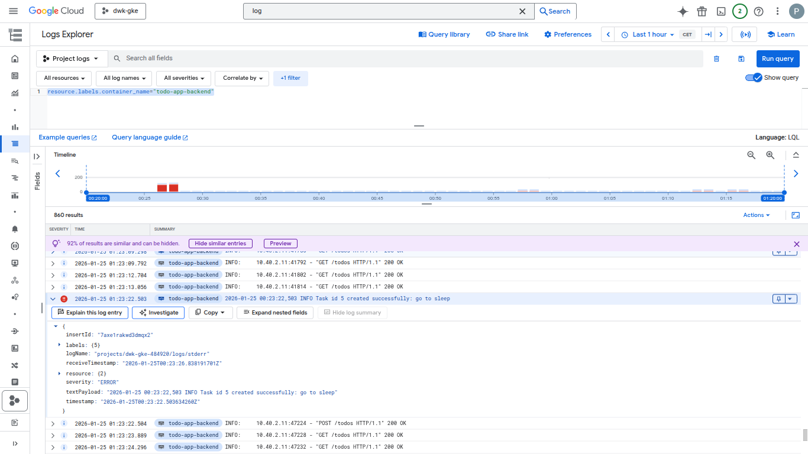
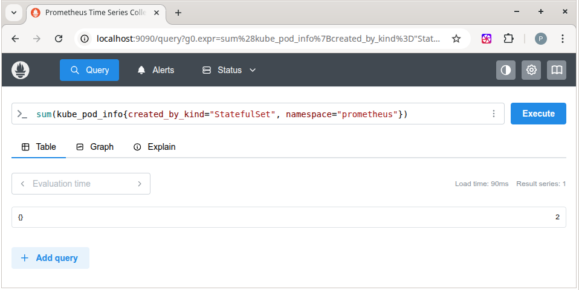
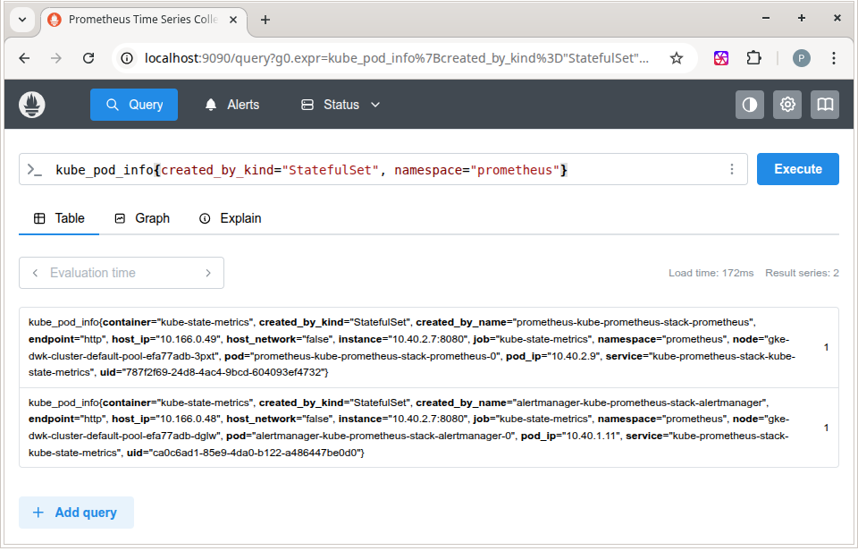

## DevOps with Kubernetes by The University of Helsinki 

[Course page](https://courses.mooc.fi/org/uh-cs/courses/devops-with-kubernetes)

## Execrises

Each exercise had release and a tag that matches the exercise number.

### Chapter 2

[1.1. Getting started](https://github.com/thefl0ur/devops-with-kubernetes/releases/tag/1.1)

[1.2. The project, step 1](https://github.com/thefl0ur/devops-with-kubernetes/releases/tag/1.2)

[1.3. Declarative approach](https://github.com/thefl0ur/devops-with-kubernetes/releases/tag/1.3)

[1.4. The project, step 2](https://github.com/thefl0ur/devops-with-kubernetes/releases/tag/1.4)

[1.5. The project, step 3](https://github.com/thefl0ur/devops-with-kubernetes/releases/tag/1.5)

[1.6. The project, step 4](https://github.com/thefl0ur/devops-with-kubernetes/releases/tag/1.6)

[1.7. External access with Ingress](https://github.com/thefl0ur/devops-with-kubernetes/releases/tag/1.7)

[1.8. The project, step 5](https://github.com/thefl0ur/devops-with-kubernetes/releases/tag/1.8)

[1.9. More services](https://github.com/thefl0ur/devops-with-kubernetes/releases/tag/1.9)

[1.10. Even more services](https://github.com/thefl0ur/devops-with-kubernetes/releases/tag/1.10)

[1.11. Persisting data](https://github.com/thefl0ur/devops-with-kubernetes/releases/tag/1.11)

[1.12. The project, step 6](https://github.com/thefl0ur/devops-with-kubernetes/releases/tag/1.12)

[1.13. The project, step 7](https://github.com/thefl0ur/devops-with-kubernetes/releases/tag/1.13)

### Chapter 3

[2.1. Connecting pods](https://github.com/thefl0ur/devops-with-kubernetes/releases/tag/2.1)

[2.2. The project, step 8](https://github.com/thefl0ur/devops-with-kubernetes/releases/tag/2.2)

[2.3. Keep them separated](https://github.com/thefl0ur/devops-with-kubernetes/releases/tag/2.3)

[2.4. The project, step 9](https://github.com/thefl0ur/devops-with-kubernetes/releases/tag/2.4)

[2.5. Documentation and ConfigMaps](https://github.com/thefl0ur/devops-with-kubernetes/releases/tag/2.5)

[2.6. The project, step 10](https://github.com/thefl0ur/devops-with-kubernetes/releases/tag/2.6)

[2.7. Stateful applications](https://github.com/thefl0ur/devops-with-kubernetes/releases/tag/2.7)

[2.8. The project, step 11](https://github.com/thefl0ur/devops-with-kubernetes/releases/tag/2.8)

[2.9. The project, step 12](https://github.com/thefl0ur/devops-with-kubernetes/releases/tag/2.9)

[2.10. The project, step 13](https://github.com/thefl0ur/devops-with-kubernetes/releases/tag/2.10)

### Chapter 4

[3.1 Pingpong GKE](https://github.com/thefl0ur/devops-with-kubernetes/releases/tag/3.1)

[3.2 Back to Ingress](https://github.com/thefl0ur/devops-with-kubernetes/releases/tag/3.2)

[3.3 To the Gateway](https://github.com/thefl0ur/devops-with-kubernetes/releases/tag/3.3)

[3.4 Rewritten routing](https://github.com/thefl0ur/devops-with-kubernetes/releases/tag/3.4)

[3.5 The project, step 14](https://github.com/thefl0ur/devops-with-kubernetes/releases/tag/3.5)

[3.6 The project, step 15](https://github.com/thefl0ur/devops-with-kubernetes/releases/tag/3.6)

[3.7 The project, step 16](https://github.com/thefl0ur/devops-with-kubernetes/releases/tag/3.7)

[3.8 The project, step 17](https://github.com/thefl0ur/devops-with-kubernetes/releases/tag/3.8)

[3.9 DBaaS vs DIY](https://github.com/thefl0ur/devops-with-kubernetes/releases/tag/3.9)

<details>
  <summary>DBaaS vs DIY</summary> 

  **Getting Started**

  DBaaS: Minimal Setup. The database is provisioned through a web interface or API by selecting size, region, and basic security settings, no manual installation or configuration needed.

  DIY: Requires significant work: preparing the server, installing software, configuring networking and users.

  **Costs**

  DBaaS: Costs are usage-based and predictable, While it may seem more expensive per month, it reduces engineering time and operational overhead.

  DIY: Infrastructure costs may be lower, especially if resources already exist. There are hidden costs related to time spent on setup, monitoring, and troubleshooting.

  **Maintenance**

  DBaaS:Maintenance tasks such as updates, patches, monitoring, and scaling are mostly automated or handled by the provider.

  DIY: All maintenance is manual or scripted. The team is responsible for updates, monitoring tools, scaling decisions, and downtime handling.

  **Control and customization**

  DBaaS: Limited control over low-level configuration. Custom database settings may be restricted by the provider.

  DIY: Full control over database configuration, operating system, and performance tuning.

  **Scaling and availability**

  DBaaS: Scaling and high availability are built in, with options for replication and automated failover configured through simple settings.

  DIY: Scaling and high availability must be designed and implemented manually, requiring careful planning and testing and also need highly qualified engineers.

</details>

[3.10 The project, step 18](https://github.com/thefl0ur/devops-with-kubernetes/releases/tag/3.10)

[3.11 The project, step 19](https://github.com/thefl0ur/devops-with-kubernetes/releases/tag/3.11)

[3.12 The project, step 20](https://github.com/thefl0ur/devops-with-kubernetes/releases/tag/3.12)

<details>
  <summary>picture of the logs when a new todo is created</summary> 

  This is funny, that standard python's logger produces output into STDERR. Didn't know about it earlier

  
</details>

### chapter 5

[4.1. Readines probe](https://github.com/thefl0ur/devops-with-kubernetes/releases/tag/4.1)

[4.2. The project, step 21](https://github.com/thefl0ur/devops-with-kubernetes/releases/tag/4.2)

[4.3 Prometheus](https://github.com/thefl0ur/devops-with-kubernetes/releases/tag/4.3)

<details>
  <summary>Query that shows the number of pods created by StatefulSets in prometheus namespaceated</summary> 

  ```
  sum(kube_pod_info{created_by_kind="StatefulSet", namespace="prometheus"})
  ```

  

  

</details>

[4.4 Your canary](https://github.com/thefl0ur/devops-with-kubernetes/releases/tag/4.4)

[4.5 The project, step 22](https://github.com/thefl0ur/devops-with-kubernetes/releases/tag/4.5)

[4.6 The project, step 23](https://github.com/thefl0ur/devops-with-kubernetes/releases/tag/4.6)

<details>
  <summary>Small demo with webhook integration</summary> 
  https://github.com/thefl0ur/devops-with-kubernetes/raw/refs/heads/master/exersice_4_6_demo.mp4

</details>


[4.7. Baby steps to GitOps](https://github.com/thefl0ur/devops-with-kubernetes/releases/tag/4.7)

[Repo state](https://github.com/thefl0ur/devops-with-kubernetes/tree/4.7/log_output)

[4.8. The project, step 24](https://github.com/thefl0ur/devops-with-kubernetes/releases/tag/4.8)

[Repo state](https://github.com/thefl0ur/devops-with-kubernetes/tree/4.8/project)

[4.9. The project, step 25](https://github.com/thefl0ur/devops-with-kubernetes/releases/tag/4.9)

[Repo state](https://github.com/thefl0ur/devops-with-kubernetes/tree/4.9/project)