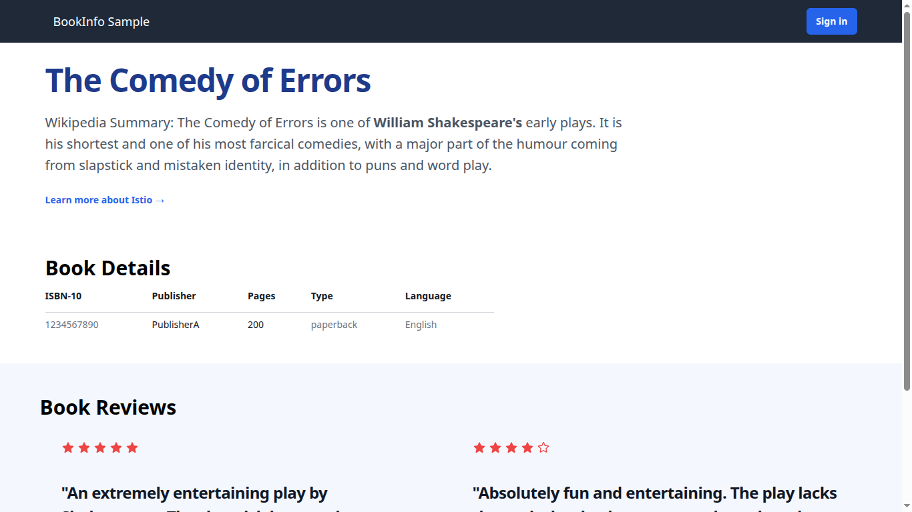
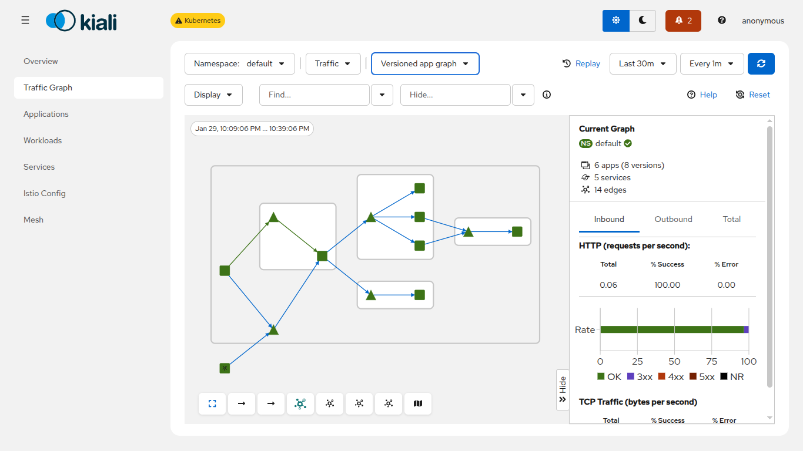

# Deloying Sample Application

[Install Istio CLI](https://istio.io/latest/docs/ambient/getting-started/)

[Setup Istio to your k3d cluster](https://istio.io/latest/docs/ambient/install/platform-prerequisites/#k3d)

[Deploy the Sample app](https://istio.io/latest/docs/ambient/getting-started/deploy-sample-app/) 

! Makefile follows `Deploy the Sample app` guide until `Clean up` step.

